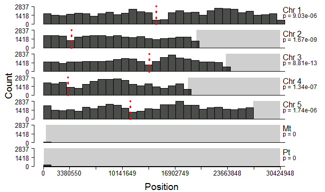
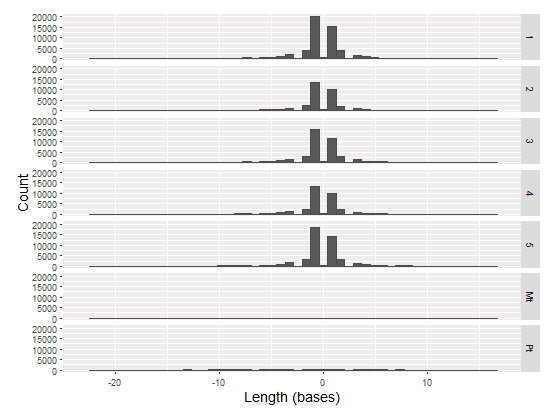
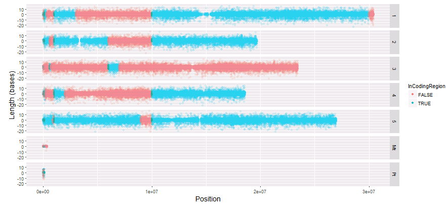
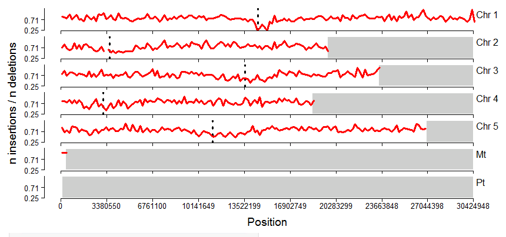
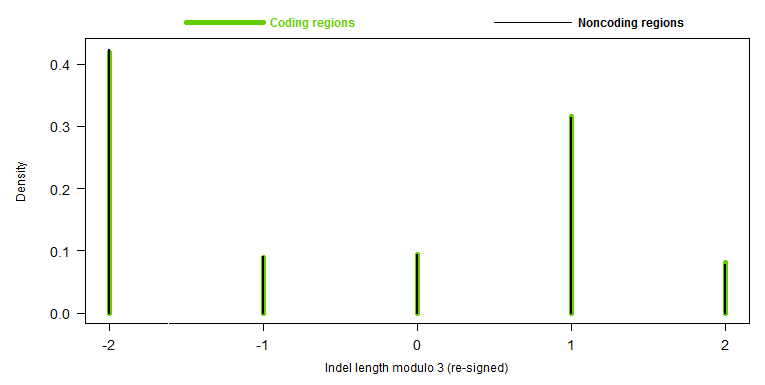

## Rationale and Project Summary  
Indels, short for insertions or deletions, are polymorphisms in DNA in which nucleotides are added or removed compared to a reference sequence. The functional consequences of indels depend on the genomic context in which they occur. Indels that occur within non-functional sequences, e.g. in introns, are inconsequential while indels that occur in coding regions often result in frameshift mutations that affect protein function.  

Due to the probable consequences of indels and their role in genome evolution, it is of interest to study the distributions of indels in a genome in population-level resequencing data. For our project, we posit the following questions: 1. Where do indels occur across a plant genome? 2. Is indel length related to genomic position? To address these questions, we identified indels in a collection of *Arabidopsis thaliana* individuals that were sequenced for the initial phase of the 1001 Genomes Project. We present the results of our analysis in an interactive web Shiny app.   

## Data 
For this project we used Illumina whole genome sequencing reads from [Cao, J. *et al.* Whole-genome sequencing of multiple Arabidopsis thaliana populations. Nat. Genet. 43, 956-963 (2011)](https://www.nature.com/articles/ng.911) representing 80 samples of *A. thaliana* sequenced across 175 sequencing runs.  We downloaded this dataset from the [European Nucleotide Archive (ENA)](https://www.ebi.ac.uk/ena) using NCBI Short Read Archive accession SRA029270. We used the ENA website interface to create a file consisting of the sample accession, secondary sample accession, run accession, and FTP addresses for each sequencing run. This file is included in the repository under [data/file_list.txt](https://github.com/biodataprog/teamproject-indelible/blob/master/data/file_list.txt).    

## Pipeline  
### Core Scripts 
**0_setup_ref.sh**  
Slurm script that downloads the *Arabidopsis thaliana* reference genome sequence from [EnsemblGenomes](http://ensemblgenomes.org/) and indexes it with the *index* command from [bwa](https://github.com/lh3/bwa) v. 0.7.12. 

**1_dl_align.sh**  
Slurm script that downloads the sequencing reads from each sequencing run listed in the [file list](https://github.com/biodataprog/teamproject-indelible/blob/master/data/file_list.txt), quality trims using [sickle](https://github.com/najoshi/sickle) v. 1.33, aligns to the reference genome with *bwa mem*, then runs [samtools](https://github.com/samtools/samtools) v. 1.4.1 to convert the resulting sequence alignment map (SAM) file into a sorted binary alignment map (BAM) file with duplicates removed. For computational efficiency, this script runs as an array job, launching an instance for each sequencing run listed in the [file list](https://github.com/biodataprog/teamproject-indelible/blob/master/data/file_list.txt), allowing each run to be processed simultaneously. The default parameters were used when running *sickle* and *bwa mem*. The read groups were set by *bwa mem* upon aligning the reads to the reference genome. The value of the SLURM_ARRAY_TASK_ID variable was used as the read group ID while the secondary sample accession was used as the read group sample (SM).     

**2_call_snps.sh**   
Slurm script that uses [freebayes](https://github.com/ekg/freebayes) v. 1.1.0 to identify variants in the population of individuals. Prior to running this script, a list of BAM files to process was generated by running the following command: 
```{bash, eval=FALSE}
ls results/*.bam > ./data/bam_list.txt
``` 
For computational efficiency, only 4 alleles at each site were considered when running *freebayes*, which was set using the *--use-best-n-alleles 4* argument.  

**3_filter_vcf.sh**  
Slurm script that uses the *vcffilter* command from [vcflib](https://github.com/vcflib/vcflib) to filter the vcf file produced by *freebayes*. We used a hard filter, keeping only indels that had at least 10 reads and a quality score of 20. 

**4_parse_vcf.py**  
Python script that takes a VCF4.1 file as input and extracts the indel position, reference sequence, alternate sequence, and chromosome number, returning a tab delimited file. Command line arguments number 1 and 2 are used to specify names of input and output files, respectively.

**5_parse_genes.py**  
This script annotates the indels parsed by script 4 with a boolean value corresponding to whether the indel is located within a coding region. This script takes as input a [list of genes](https://github.com/biodataprog/teamproject-indelible/blob/master/data/genes.txt) and positions derived from the *A. thaliana* genome annotation (gff3), which was downloaded from [EnsemblGenomes](http://ensemblgenomes.org/).  

### Shiny Application 
shiny_app_1 plots the counts of indels across each chromosome and the plastid genomes. There are interacive controls for the width of the windows in which counts are taken, a chomosome/organelle selecter drop-down menu, an indel type selector and a switch to draw a vertical line at the approximate position of each centromere. Additionally, there is a drop-down to switch between a Kolmogorov-Smirnov test against a uniform and Possion probability distribution on windows counts (p-values plotted under chromosome number label).

shiny_app_2 plots histograms of indel length for all, or each, chromosome/organellar genome. Positive values are insertions and negative values are deletions. There are interactive controls for narrowing the range of values visualized.

shiny_app_3 plots a scatter plot of indel length by indel position, color coded by whether the indel is in a coding or non-coding region. It has controls and layout familiar from previous apps.

shiny_app_4 plots the ratio of insertions to deletions within variable window widths across each chromosome/organellar genome. This has the same structure as shiny_app_1.

shiny_app_5 plots discrete values histograms of the modulo of indel length by three for coding and non-coding regions. It has interactive controls familiar from previous apps. 

### Additional Scripts
**dl_results.sh**  
To facilitate sharing the filtered vcf file produced by script 3, the data was uploaded to figshare. This script creates a results folder and downloads the filtered vcf file to this directory.  

**dl_annot.sh**  
This script downloads the annotation of the *A. thaliana* genome from EnsemblGenomes and creates a [list of gene positions](https://github.com/biodataprog/teamproject-indelible/blob/master/data/genes.txt) that are then utilized by script 5. 

## Results 
  
**Figure 1.** Visualizing the distibution of indels across the chromosomes and organllar genomes the most noticeable pattern is the deficit of indels near the centromeres. This may be due to biology, but is likely an artifact of the sequencing technology which is less powerful in this region of mostly heterochromatin. The distribution of indels at all but a few very large window lengths is statistically different from a uniform or Poisson distribution (p < 0.05). The plastid genomes have regions where we did not detect any indels. Both insertions and deletions are similarly distributed on a given chromosome/organellar genome.

  
**Figure 2.** The distribution of indel lengths is similiar across all five chromosomes. Positive lengths indicate insertions while negative lengths indicate deletions. There are marginally, but consistently, more deletions than insertions across every chromosome in the genome. The majority of indels are small, ranging between 1-3 bp in length. 

  
**Figure 3.** There is no clear relationship between genomic position and indel length. Additionally, there are large islands where indels overwhelmingly lie in coding (blue) or non-coding (red) regions.  

  
**Figure 4.** The ratio of insertions to deletions is variable across the chromosomes though there is no clear pattern. The position of lowest rato value on each chromosome coincides with the approximate position of the centromere (dotted vertical line). However, the ratio of insertions to deletions are relatively constant across the organellar genomes.

  
**Figure 5.** Coding and non-coding regions have similar densities of indels that cause (modulo 1,2) or do not cause (modulo 0) frameshifts. This is an interesting observation as we would expect to find relatively fewer frameshift indels given their potential to have deleterious effects on protein function.

## Acknowledgements
The authors would like to thank Professor Jason Stajich for guidance and suggestions throughout the course of this project. All code is hosted on github at this [link](https://github.com/biodataprog/teamproject-indelible). The Shiny application was deployed to the cloud with [Shinyapps.io](https://www.shinyapps.io) and can be accessed [here](https://cjfiscus.shinyapps.io/shiny_app/). CF wrote scripts 0, 1, 2, 3, 5, and both "additional scripts". GM wrote script 4 and the Shiny app. CF and GM contributed equally to writing this manuscript.     
